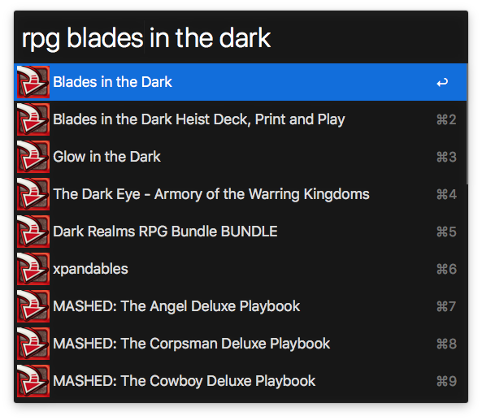

# Alfred DriveThruRPG Workflow

Search DriveThruRPG from the comfort of Alfred.



## Install

```
$ npm install --global alfred-drivethrurpg
```

*Requires [Node.js](https://nodejs.org) 4+ and the Alfred [Powerpack](https://www.alfredapp.com/powerpack/).*


## Usage

In Alfred, type `rpg` then your query to search for DriveThruRPG items. Hit
<kbd>Enter</kbd> to go to the items's DriveThruRPG page.


## License

MIT © [Wes Baker](http://wesbaker.com)
